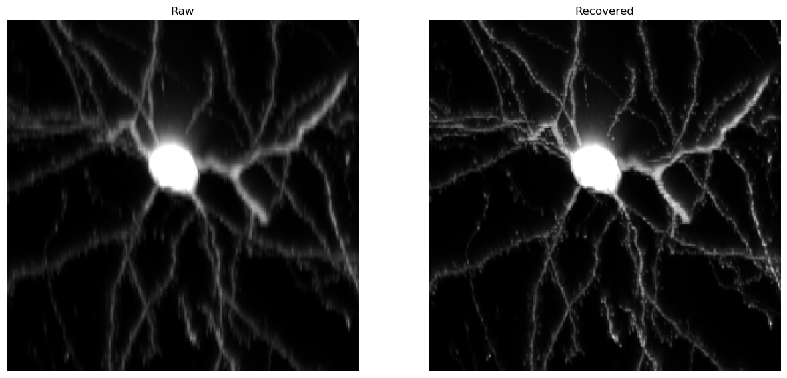
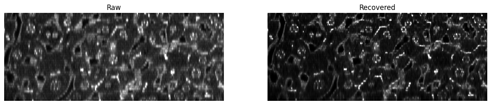

# SSAI-3D: System- and Sample-agnostic Isotropic 3D Microscopy


## Overview

This repository provides the implementation and resources for [SSAI-3D](https://arxiv.org/abs/2406.06337), a deep learning framework for achieving high-fidelity isotropic 3D resolution recovery in microscopy. SSAI-3D is a weakly physics-informed, domain-shift-resistant framework demonstrated across diverse microscopy system and a wide array of 3D biological samples.


---

## System Requirements

### Software Requirements

#### Primary Dependencies

```python
python 3.9.5
pytorch 1.11.0
cuda 11.3
```

### Hardware Requirements

- NVIDIA RTX 3080 GPU is recommended.

Note: It is advisable to utilize a system with at least 16 GB of RAM for optimal performance.

--- 

## Installation Guide

Typical installation time on a desktop computer is estimated to be around 10 minutes.

### Setup Instructions

To install the necessary dependencies and set up the environment, execute the following commands:

```
pip install -r requirements.txt
python setup.py develop --no_cuda_ext
```

---

## Demonstration -- General Testing uint16 dataset


**Runtime Estimate**  
Using the provided network checkpoints, the typical runtime for an uint16 dataset on a desktop computer is approximately **1 minute**.

### Data Preparation 
Please prepare own data, in a folder of sequence of two dimensional any-bit tiff or png files

### Model Checkpoints
Please download the pre-trained, fine-tuned model from [here](https://drive.google.com/file/d/1mhpZ00h3UvXvTfsA_feYd1B2sWD-06uY/view?usp=sharing), and move it to the following directory:  
```
./experiments/pretrained_models
```


---
## Demonstration -- Testing uint16

**Runtime Estimate**  
Using the provided network checkpoints, typical run time to restore resolution for an uint16 dataset on a desktop computer is estimated to be around **5 minutes**.

### Data Preparation 

- The required anisotropic raw dataset can be downloaded from [here](https://drive.google.com/file/d/1p3CUWhaSJXAA_9k8p4nRrhjBmbegQ-vJ/view?usp=sharing). Once downloaded, please transfer it to `~/SSAI-3D/demo` directory.

### Pre-trained Model Checkpoints

- Download the pre-trained model checkpoint from [here](https://drive.google.com/file/d/1Q3d7y96dQsd3Xk4l8c05M2VnUlu9q9CL/view?usp=sharing), and transfer it to `~/SSAI-3D/demo/experiments/demo_neurons`
### Model Inference

For detailed instructions on conducting model inference, please consult the `./demo/demo_test.ipynb` file within the demo directory.


---
## Demonstration -- Training uint16

Using the pre-trained NAFNet weights, typical fine-tuning for an uint16 dataset on a desktop computer is estimated to be around **5~30 minutes**.

### Data Preparation 

- The required anisotropic raw dataset can be downloaded from [here](https://drive.google.com/file/d/1p3CUWhaSJXAA_9k8p4nRrhjBmbegQ-vJ/view?usp=sharing). Once downloaded, please transfer it to `~/SSAI-3D/demo` directory.

### Pre-trained Model Checkpoints

- Download the pre-trained model checkpoint from [here](https://drive.google.com/file/d/14D4V4raNYIOhETfcuuLI3bGLB-OYIv6X/view), and transfer it to `~/SSAI-3D/demo/experiments/pretrained_models`.

- [OPTIONAL] If denoising is needed, download model checkpoint from [here](https://drive.google.com/file/d/1Lkg5a8xtjze7cKitdMl8bIY38cLAIojT/view?usp=sharing), and transfer it to `~/SSAI-3D/demo/experiments/pretrained_models`. Please note that the denoising model is trained on private data.

### Model Training

For detailed instructions on conducting model inference, please consult the `./demo/demo_train.ipynb` file within the demo directory.


### Results 

We have provided a training demo using an example dataset available [here](https://zenodo.org/records/7882519). This dataset consists of 16-bit unsigned integer images of mouse brain neurons. Running the demo will yield results as shown below.




